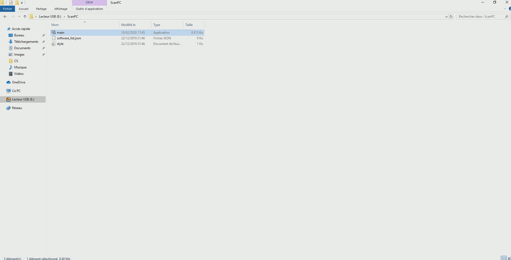

# ScanPC
[](https://www.gnu.org/licenses/agpl-3.0.en.html)

[](https://www.python.org/)

ScanPC is an audit tool for Windows.  
It scans Windows computers to gather informations like :  
- the user accounts list
- the password policy
- the share folders list
- the hardware configuration
- the OS version
- the network interfaces
- the Windows updates (KB) list
- the softwares installed
- the firewall state
- the processes list
- the services list
- the antivirus state  

Started since October 2016  
Python 3.6 32 bit is used for all new developments.  
Project ongoing.  

## Compatibility
This software has been succesfully tested on the following Microsoft Windows systems :  
- XP x86
- 7 x86 and x64
- 10 x86 and x64

## Getting Started
**Download the project on your computer.**
```
git clone https://github.com/alevoski/ScanPC.git
```

**Install the required pip modules**
```
pip install -r requirements.txt
```

If you want to run it on Python 3.4 (for Windows XP compatibility) :
- you must install [pywin32-219.win32-py3.4.exe](https://sourceforge.net/projects/pywin32/files/pywin32/Build%20219/pywin32-219.win32-py3.4.exe/download)
- you must install psutil v3.4.2
```
pip install psutil==3.4.2
```
- you must install wmi (tested with v1.4.9)
```
pip install wmi
```

**Optional tool**  
RemoveDrive.exe from <https://www.uwe-sieber.de/drivetools_e.html> website is used to dismount device used to scan the computers.  


## HOW TO USE ?
**Method 1 - With Python and all dependencies**  
```
cd CS/
python main.py
```

**Method 2 - Compile the code into an executable file**  
You will need pyinstaller module
```
pip install pyinstaller
c:\<yourpythonpath>\Scripts\pyinstaller.exe --hiddenimport win32timezone --onefile --icon=logoScanPC.ico main.py
```
A folder named "dist" will be created with a scanPC executable file.  
***Note*** : you need to compile with a 32 bit Python version to perform scan on x86 and x64 Windows OS  
***Note 2*** : you need to compile with Python 3.4 x86 for a maximum OS compatibility  
***Note 3*** : you need [Visual C++ 2010 X86](https://www.microsoft.com/en-US/download/confirmation.aspx?id=5555) to execute a compiled Python program on the targeted computers

Put the code or the exe on a USB key and go scanning some Windows computers.  
Whatever method you chose, you will need **software_list.json** and **style.css** files in the same directory where you run ScanPC !  

***Note : To limit viruses spreading, you should always analyze your scanning devices between two scans !***  
[Decontamine_Linux can help you !](https://github.com/alevoski/decontamine_Linux)

#### Demo  
  

## Author
Alexandre Buissé

## License
ScanPC. Audit tool for Windows.  
Copyright (C) 2019 Alexandre Buissé alevoski@pm.me

This program is free software: you can redistribute it and/or modify  
it under the terms of the GNU Affero General Public License as published  
by the Free Software Foundation, either version 3 of the License, or  
(at your option) any later version.  

This program is distributed in the hope that it will be useful,  
but WITHOUT ANY WARRANTY; without even the implied warranty of  
MERCHANTABILITY or FITNESS FOR A PARTICULAR PURPOSE.  See the  
GNU Affero General Public License for more details.  

You should have received a copy of the GNU Affero General Public License  
along with this program.  If not, see <https://www.gnu.org/licenses/>.
